# [**CSS Tutorial - Zero to Hero (Complete Course**)](https://www.youtube.com/watch?v=1Rs2ND1ryYc)🚀

---

## Course Content 📃

| Section No. |      List of Content      |
| :---------: | :-----------------------: |
|      1      |       Introduction        |
|      2      |     CSS Introduction      |
|      3      |  Selectors & Properties   |
|      4      |   Coloring & Formatting   |
|      5      | Fonts & Text Manipulation |
|      6      |          Layout           |
|      7      |          Flexbox          |
|      8      |           Grid            |
|      9      | Animations & Transitions  |
|     10      |         Challenge         |

## Course GitHub Repository 💻

https://github.com/Video-Lab/css-course-content

---

## Section 1 - Introduction

Let's get Started!

- Downloading Necessary Software
  Download any code editor of your choice.
  Here are some: VS Code, Sublime Text, Atom, etc.

- Where to Find Project File

  https://github.com/Video-Lab/css-course-content

---

## Section 2 - CSS: An Introduction

### What is CSS ?

- CSS stands for Cascading Style Sheet
- It is a language used to give styling and design to websites
- It is the standard for styling websites, used by most/all websites across the globe
- It usually goes hand-in-hand with HTML, while CSS3 (the latest version) brings lots of new features to the table

### Why use CSS ?

- There are many reasons to use CSS, such as:
- Styling
- Layout & Design
- Animations
- Font Changes
- Organization
- Grid Systems

### How is CSS used ?

- Typically, a file is saved in the .css format, and linked to using an HTML tag
- CSS selectors can be used to address parts of the page to style and use
- HTML Elements are given Class and ID attributes, which are then used to manipulate in CSS
- It typically follows this method: Select, then Edit

### Creating & Linking a CSS Stylesheet

HTML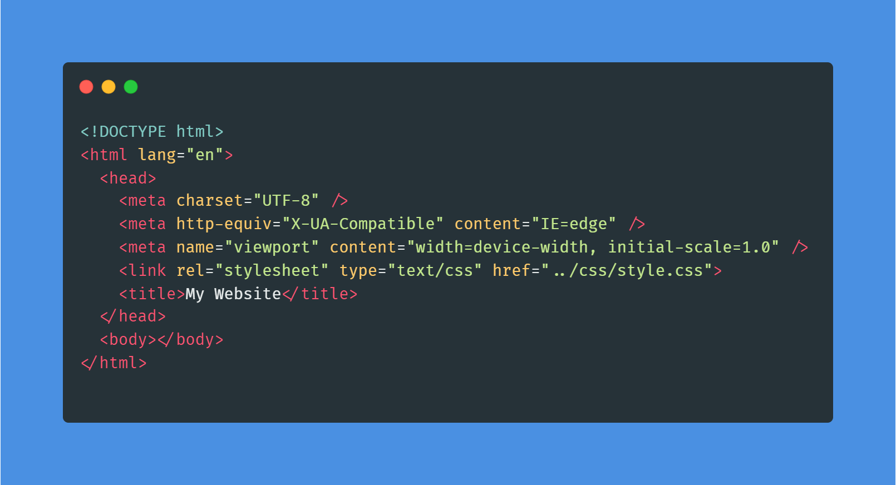

The <link> tag along with the rel attribute(relationship of the current document with the linked document), in our case, the linked document is "stylesheet" does the work.

### How to Test a Stylesheet ?

Easiest way to test it is typing a random obvious property that changes the way a website looks.
Something just like this:

CSS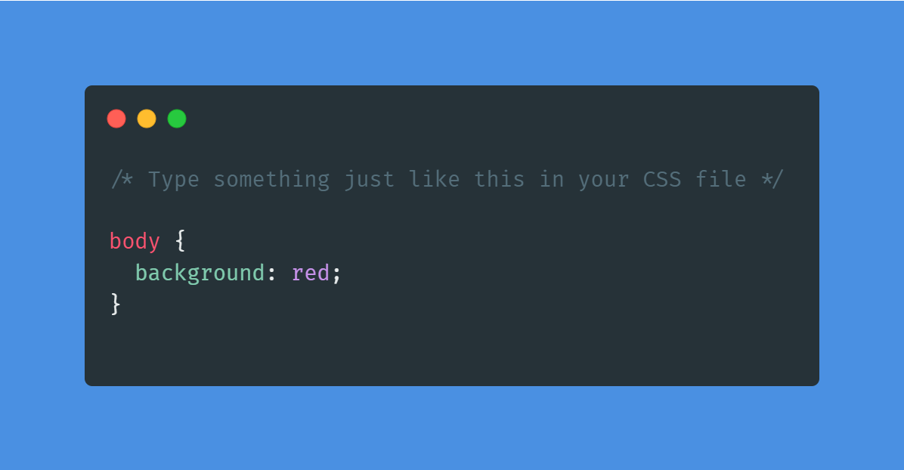

Now check the background of your HTML page in browser. If it's red then the stylesheet is linked properly else it's not.

---

## Section 3 - CSS Selectors

Now, there are two different documents that we've got, the HTML doc & the CSS doc. As these two documents are disconnected i.e. you cannot just type random things and have them appear on your screen. Hence, there is a need of selectors to apply styling to the HTML elements.

### What is a selector ?

- Selectors are ways of grabbing and manipulating HTML
- There are many different ways to select, however they all turn out the same way
- Different selectors have different applications

### Selectors : The Element Selector

- You can select entire elements without any special characters
- This applies to all the elements with that tag on the page
- It ranks on the bottom of the specificity scale

Here's an example:

HTML
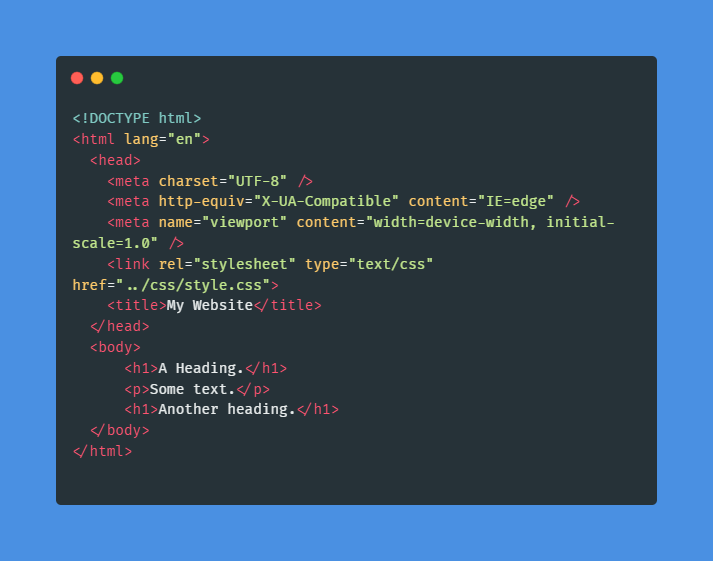

CSS

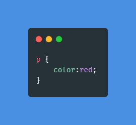

Result

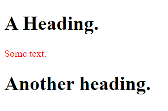

### Selectors : The Class Selector

- This is used to select elements with a certain class name
- Can be used on any and all elements with that class
- Can be used multiple times, and is selected with the .(period) symbol

Here's an example:

HTML
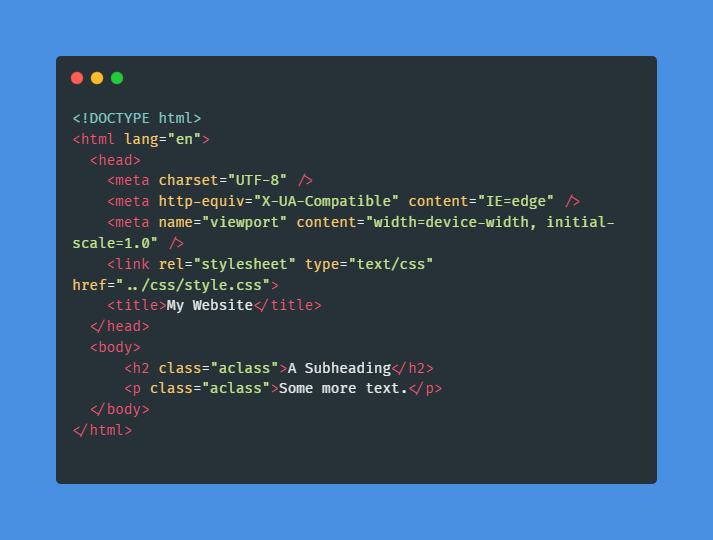

CSS

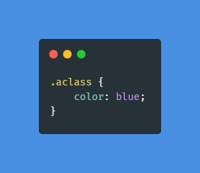

Result

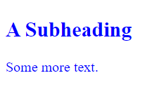

### Selectors : The ID Selector

- This is used to select elements with a certain ID name
- Can be used on any and all elements with that ID
- Unlike classes, it can only be used on one element at a time, and is selected with the # symbol. However, it is possible to use it more than once.

Here's an example:

HTML
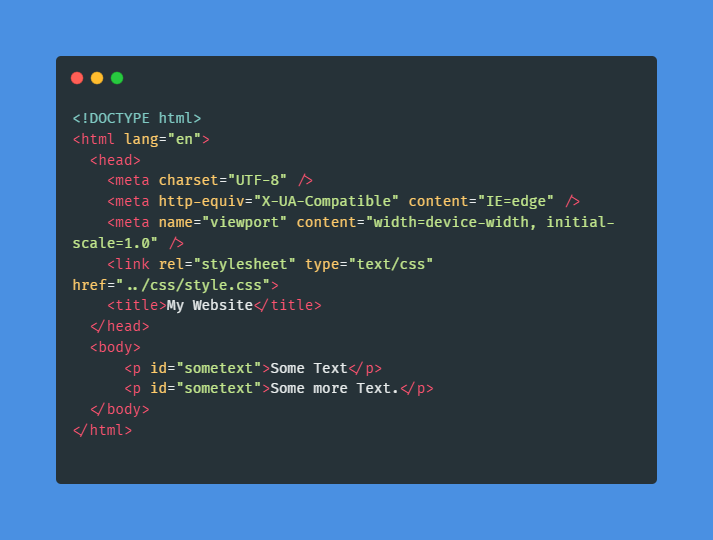

CSS

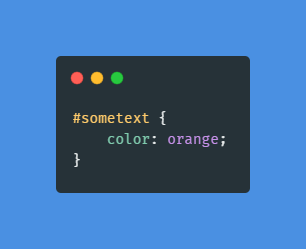

Result

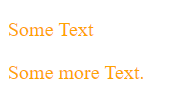

### Classes & ID in HTML

Here is it's usage:

HTML


CSS

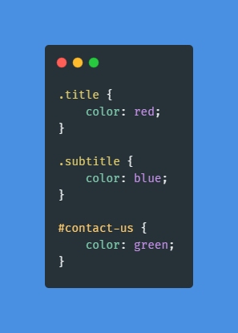

Result
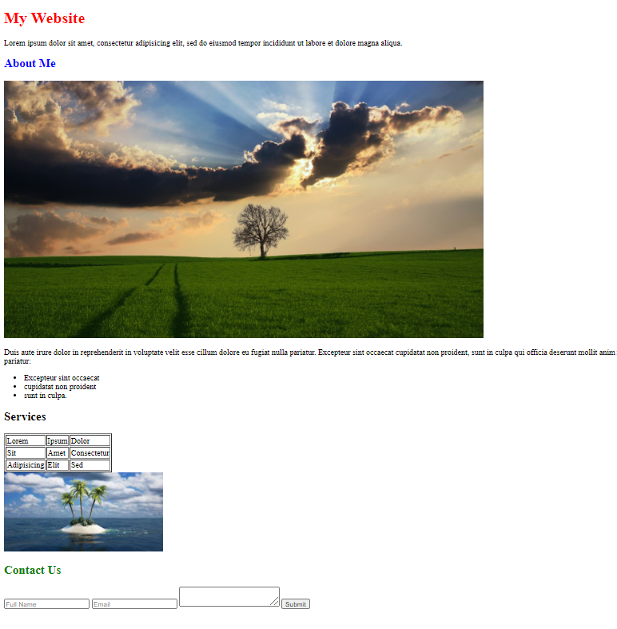

You may see the changes in the text color of "My Website", "About Me" and "Contact Us".

### Specificity & When to use Selectors

Order of Specificity:

```
inline-style > ID > Class > Elements
```

Here's an example:

HTML
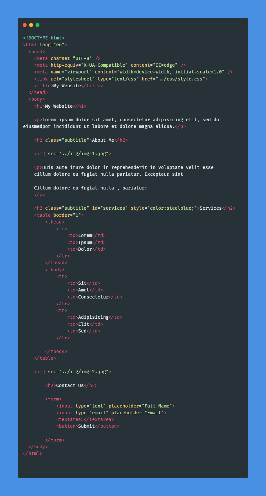

CSS

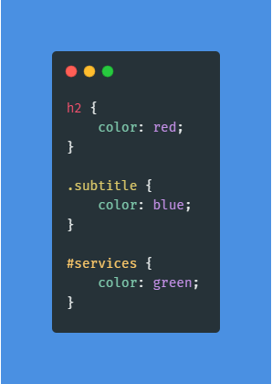

Result


As you may see that the Order of Specificity has been followed for the above example.
The <h2> Services </h2> has both the class and id selectors as well as inline styling. Finally, the inline-style i.e. `color: steelblue` is all that is applied to the element as inline-style have the highest specificity.

### Class vs ID

Class & ID selectors individually are meant for different purposes though you may find no difference as both apply the same styling. It is the usage that makes all the difference. In the above example, one must group all the `<h2>` under a single class to avoid applying style to each individually. Hence, class selectors help avoid repetition. On the other hand, ID selector, as the name itself suggests, "ID" should be unique to a particular element and must be used accordingly. All these are the best practices one may follow to write better code.

### Pseudo-selectors

CSS

```css
h2:hover {
  color: red;
}

li:only-child {
  color: purple;
}

td:only-child {
  color: purple;
}

#google-link:link {
  color: blue;
}

#google-link:visited {
  color: red;
}
```

Result
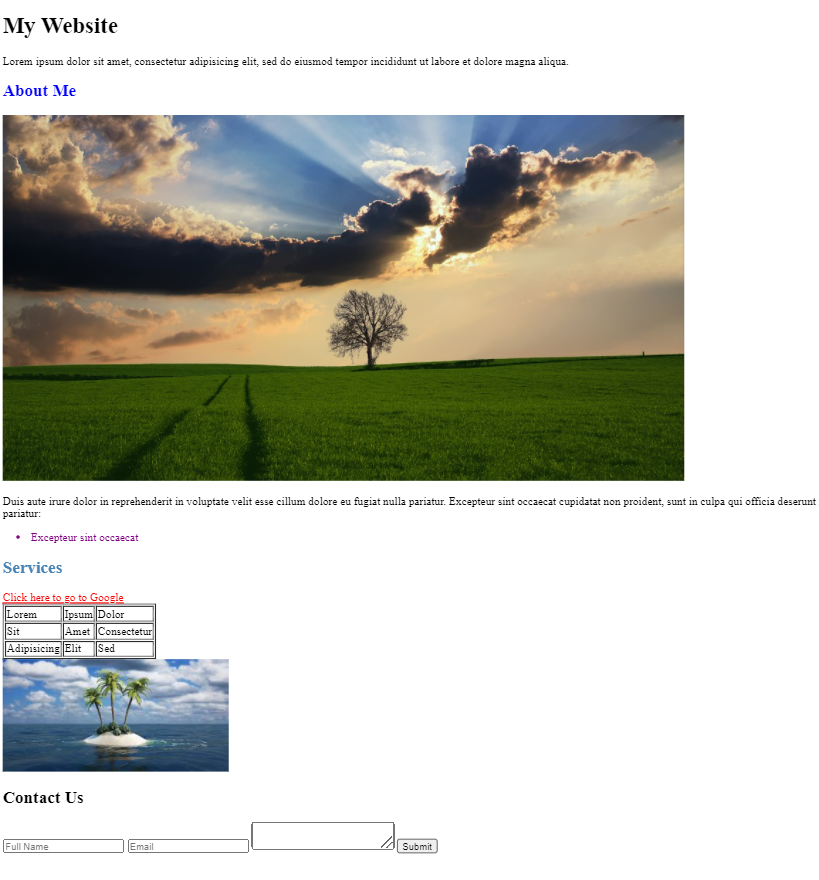

The "About Me" heading on hover changes its color to red from blue. Its done using the hover pseudo class selector. There are also some other pseudo-selectors such as `li:only-child , :link and :visited`. You may see the changes for the same in the result, the purple colored list element and the red colored anchor tag that says "Click here to go to Google".

### Advanced Selectors

1. Adjacent Sibling Selector
   It selects every single element that directly follows a different element.

   ```css
   h2 + a {
     color: red;
   }
   /* Selects every anchor tag that follows the <h2> tag */
   ```

2. General Sibling Selector
   It selects the elements that go directly one after another except they have to be sharing the same parent. For example,

   HTML

   ```html
   <!-- Case-1: button inside the form element -->
   <form>
   	<input type="text" placeholder="Full Name">
   	<input type="email" placeholder="Email">
   	<textarea></textarea>
   	<button>Submit</button>
   </form>
   <!-- Here in this case, the textarea and button share the common parent element(form). Hence, the button color will be changed to purple.

   <!-- Case-2: button outside the form element -->
   <form>
   	<input type="text" placeholder="Full Name">
   	<input type="email" placeholder="Email">
   	<textarea></textarea>
   </form>
   <button>Submit</button>
   <!-- Now in this case, the textarea and button don't share the common parent. Hence, the style won't be applied.
   ```

   CSS

   ```css
   textarea ~ button {
     color: purple;
   }
   /*Selects every button that is after a text area sharing common parent*/
   ```

3. Child Selector
   Selects every direct child of a certain element.

   ```css
   ul > li {
     color: blue;
   }
   /* Selects every <li> that is directly linked to the <ul> */
   ```

4. Descendant Selector
   Selects every child of a certain element.

   ```css
   ul li {
     color: green;
   }
   /* Selects every <li> inside the <ul> regardless of the connection i.e. children, grandchildren, great grandchildren and so on */
   ```

   Here's an example showing the difference between Child & Descendant Selectors.

   HTML

   ```html
   <ul>
     <li>Excepteur sint occaecat</li>
     <li>
       <ol>
         <li>My numbered list items</li>
       </ol>
     </li>
   </ul>
   ```

   CSS

   ```css
   /* Child Selector */
   ul > li {
     color: blue;
   }
   ```

   Result

   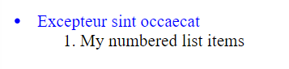

This is the result that we get through a child selector. It ignores the `<li>` present in the `<ol>` inside the parent `<ul>`.

HTML

```html
<ul>
  <li>Excepteur sint occaecat</li>
  <li>
    <ol>
      <li>My numbered list items</li>
    </ol>
  </li>
</ul>
```

CSS

```css
/* Descendant Selector */
ul li {
  color: green;
}
```

Result

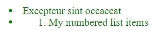

This is the result that we get through a descendant selector. It considers every `<li>` present inside the parent `<ul>`.

### Attribute Selectors

It allows selecting elements based on their attributes

1. General Attribute Selector
   It allows direct selection of an HTML element using a specific attribute.
   Here are a few examples,
   HTML

   ```html
   <h2 class="subtitle">This is a h2</h2>
   ```

   CSS

   ```css
   h2[class="subtitle"] {
     color: red;
   }
   ```

HTML

```html
 
```

CSS

```css
img[src*="../img/"] {
  border: 10px solid black;
}
/* This is an image source attribute selector. It selects all the images which that include "../img/" (path) anywhere in their source(src) attribute.

A ^ symbol inplace of the * symbol would select all the images which include "../img/" (path) at the beginning in their source(src) attribute.

A $ symbol inplace of the * symbol would select all the images which include "../img/" (path) at the end in their source(src) attribute. */
```

2. Whitespace Attribute Selector
   It allows selecting specific class from a number of classes of an HTML element.
   For example,
   HTML

```html
<h2 class="subtitle article-subtitle">About Me</h2>
```

There are two classes assigned to this element. Now, we got to select this element only using the "article-subtitle" class. So, here's the CSS for the same.

CSS

```css
h2[class~="article-subtitle"] {
  background: green;
}
```

### What are Properties ?

They are written inside the selectors and they define the way CSS is used. A selector basically just targets an element but it is the properties that give the real meaning to the selector without which the selectors would just be useless.

Syntax

```css
selector-name {
  property-name: property-value;
}
/* Note that the colon & semi-colon are mandatory while defining a property */
```

### The CSS General Rule

```css
selector-name {
  /* CSS block */
  property1: value;
  property2: value;
}
```

---
