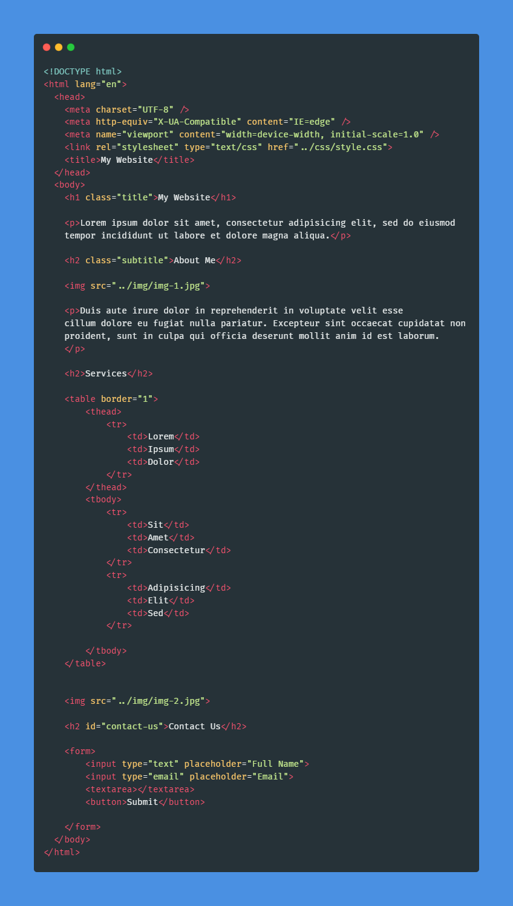
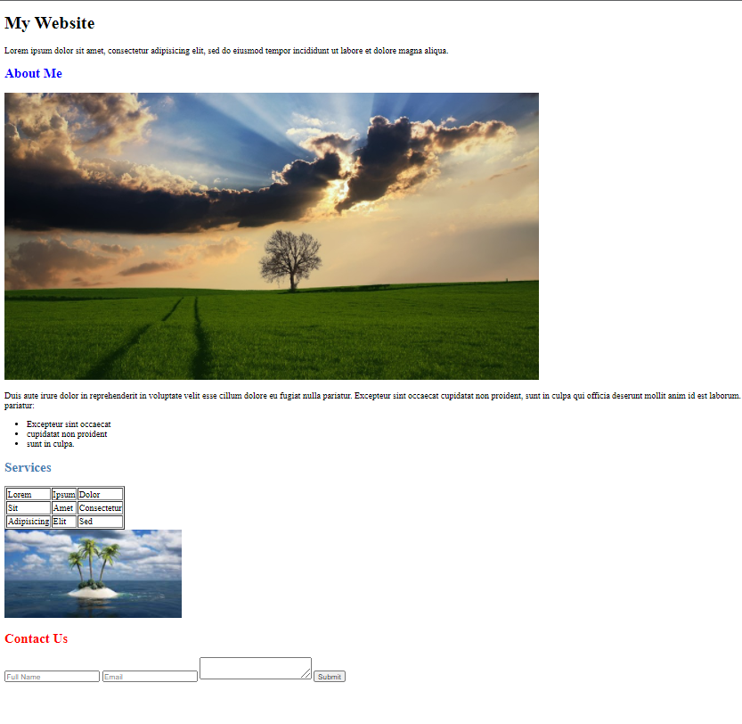

# [**CSS Tutorial - Zero to Hero (Complete Course**)](https://www.youtube.com/watch?v=1Rs2ND1ryYc)🚀

---

[TOC]

## Course Content 📃

| Section No. |      List of Content      |
| :---------: | :-----------------------: |
|      1      |       Introduction        |
|      2      |     CSS Introduction      |
|      3      |  Selectors & Properties   |
|      4      |   Coloring & Formatting   |
|      5      | Fonts & Text Manipulation |
|      6      |          Layout           |
|      7      |          Flexbox          |
|      8      |           Grid            |
|      9      | Animations & Transitions  |
|     10      |         Challenge         |

## Course GitHub Repository 💻

https://github.com/Video-Lab/css-course-content

---

## Section 1 - Introduction

Let's get Started!

- Downloading Necessary Software
  Download any code editor of your choice.
  Here are some: VS Code, Sublime Text, Atom, etc.

- Where to Find Project File

  https://github.com/Video-Lab/css-course-content

---

## Section 2 - CSS: An Introduction

### What is CSS ?

- CSS stands for Cascading Style Sheet
- It is a language used to give styling and design to websites
- It is the standard for styling websites, used by most/all websites across the globe
- It usually goes hand-in-hand with HTML, while CSS3 (the latest version) brings lots of new features to the table

### Why use CSS ?

- There are many reasons to use CSS, such as:
- Styling
- Layout & Design
- Animations
- Font Changes
- Organization
- Grid Systems

### How is CSS used ?

- Typically, a file is saved in the .css format, and linked to using an HTML tag
- CSS selectors can be used to address parts of the page to style and use
- HTML Elements are given Class and ID attributes, which are then used to manipulate in CSS
- It typically follows this method: Select, then Edit

### Creating & Linking a CSS Stylesheet

HTML

The <link> tag along with the rel attribute(relationship of the current document with the linked document), in our case, the linked document is "stylesheet" does the work.

### How to Test a Stylesheet ?

Easiest way to test it is typing a random obvious property that changes the way a website looks.
Something just like this:

CSS

Now check the background of your HTML page in browser. If it's red then the stylesheet is linked properly else it's not.

---

## Section 3 - CSS Selectors

Now, there are two different documents that we've got, the HTML doc & the CSS doc. As these two documents are disconnected i.e. you cannot just type random things and have them appear on your screen. Hence, there is a need of selectors to apply styling to the HTML elements.

### What is a selector ?

- Selectors are ways of grabbing and manipulating HTML
- There are many different ways to select, however they all turn out the same way
- Different selectors have different applications

### Selectors : The Element Selector

- You can select entire elements without any special characters
- This applies to all the elements with that tag on the page
- It ranks on the bottom of the specificity scale

Here's an example:

HTML


CSS


Result


### Selectors : The Class Selector

- This is used to select elements with a certain class name
- Can be used on any and all elements with that class
- Can be used multiple times, and is selected with the .(period) symbol

Here's an example:

HTML


CSS


Result


### Selectors : The ID Selector

- This is used to select elements with a certain ID name
- Can be used on any and all elements with that ID
- Unlike classes, it can only be used on one element at a time, and is selected with the # symbol. However, it is possible to use it more than once.

Here's an example:

HTML


CSS


Result


### Classes & ID in HTML

Here is it's usage:

HTML



CSS


Result


You may see the changes in the text color of "My Website", "About Me" and "Contact Us".

### Specificity & When to use Selectors

Order of Specificity:

```
inline-style > ID > Class > Elements
```

Here's an example:

HTML


CSS


Result



As you may see that the Order of Specificity has been followed for the above example.
The `<h2> Services </h2>` has both the class and id selectors as well as inline styling. Finally, the inline-style i.e. `color: steelblue` is all that is applied to the element as inline-style have the highest specificity.


### Class vs ID

Class & ID selectors individually are meant for different purposes though you may find no difference as both apply the same styling. It is the usage that makes all the difference. In the above example, one must group all the `<h2>` under a single class to avoid applying style to each individually. Hence, class selectors help avoid repetition. On the other hand, ID selector, as the name itself suggests, "ID" should be unique to a particular element and must be used accordingly. All these are the best practices one may follow to write better code.

### Pseudo-selectors

CSS

```css
h2:hover {
  color: red;
}

li:only-child {
  color: purple;
}

td:only-child {
  color: purple;
}

#google-link:link {
  color: blue;
}

#google-link:visited {
  color: red;
}
```

Result


The "About Me" heading on hover changes its color to red from blue. Its done using the hover pseudo class selector. There are also some other pseudo-selectors such as `li:only-child , :link and :visited`. You may see the changes for the same in the result, the purple colored list element and the red colored anchor tag that says "Click here to go to Google".

### Advanced Selectors

1. Adjacent Sibling Selector
   It selects every single element that directly follows a different element.

   ```css
   h2 + a {
     color: red;
   }
   /* Selects every anchor tag that follows the <h2> tag */
   ```

2. General Sibling Selector
   It selects the elements that go directly one after another except they have to be sharing the same parent. For example,

   HTML

   ```html
   <!-- Case-1: button inside the form element -->
   <form>
   	<input type="text" placeholder="Full Name">
   	<input type="email" placeholder="Email">
   	<textarea></textarea>
   	<button>Submit</button>
   </form>
   <!-- Here in this case, the textarea and button share the common parent element(form). Hence, the button color will be changed to purple.
   
   <!-- Case-2: button outside the form element -->
   <form>
   	<input type="text" placeholder="Full Name">
   	<input type="email" placeholder="Email">
   	<textarea></textarea>
   </form>
   <button>Submit</button>
   <!-- Now in this case, the textarea and button don't share the common parent. Hence, the style won't be applied.
   ```

   CSS

   ```css
   textarea ~ button {
     color: purple;
   }
   /*Selects every button that is after a text area sharing common parent*/
   ```

3. Child Selector
   Selects every direct child of a certain element.

   ```css
   ul > li {
     color: blue;
   }
   /* Selects every <li> that is directly linked to the <ul> */
   ```

4. Descendant Selector
   Selects every child of a certain element.

   ```css
   ul li {
     color: green;
   }
   /* Selects every <li> inside the <ul> regardless of the connection i.e. children, grandchildren, great grandchildren and so on */
   ```

   Here's an example showing the difference between Child & Descendant Selectors.

   HTML

   ```html
   <ul>
     <li>Excepteur sint occaecat</li>
     <li>
       <ol>
         <li>My numbered list items</li>
       </ol>
     </li>
   </ul>
   ```

   CSS

   ```css
   /* Child Selector */
   ul > li {
     color: blue;
   }
   ```

   Result

   

This is the result that we get through a child selector. It ignores the `<li>` present in the `<ol>` inside the parent `<ul>`.

HTML

```html
<ul>
  <li>Excepteur sint occaecat</li>
  <li>
    <ol>
      <li>My numbered list items</li>
    </ol>
  </li>
</ul>
```

CSS

```css
/* Descendant Selector */
ul li {
  color: green;
}
```

Result


This is the result that we get through a descendant selector. It considers every `<li>` present inside the parent `<ul>`.

### Attribute Selectors

It allows selecting elements based on their attributes

1. General Attribute Selector
   It allows direct selection of an HTML element using a specific attribute.
   Here are a few examples,
   HTML

   ```html
   <h2 class="subtitle">This is a h2</h2>
   ```

   CSS

   ```css
   h2[class="subtitle"] {
     color: red;
   }
   ```

HTML

```html
 
```

CSS

```css
img[src*="../img/"] {
  border: 10px solid black;
}
/* This is an image source attribute selector. It selects all the images which that include "../img/" (path) anywhere in their source(src) attribute.

A ^ symbol inplace of the * symbol would select all the images which include "../img/" (path) at the beginning in their source(src) attribute.

A $ symbol inplace of the * symbol would select all the images which include "../img/" (path) at the end in their source(src) attribute. */
```

2. Whitespace Attribute Selector
   It allows selecting specific class from a number of classes of an HTML element.
   For example,
   HTML

```html
<h2 class="subtitle article-subtitle">About Me</h2>
```

There are two classes assigned to this element. Now, we got to select this element only using the "article-subtitle" class. So, here's the CSS for the same.

CSS

```css
h2[class~="article-subtitle"] {
  background: green;
}
```

### What are Properties ?

They are written inside the selectors and they define the way CSS is used. A selector basically just targets an element but it is the properties that give the real meaning to the selector without which the selectors would just be useless.

Syntax

```css
selector-name {
  property-name: property-value;
}
/* Note that the colon & semi-colon are mandatory while defining a property */
```

### The CSS General Rule

```css
selector-name {
  /* CSS block */
  property1: value;
  property2: value;
}
```

---

## Section 4 - Coloring & Formatting

### Coloring Text

```css
#title {
  color: rgb(186, 133, 9);
}

.subtitle {
  color: rgb(219, 168, 50);
}
```

### Background Colors

```css
body {
  background: rgb(204, 229, 255);
}
```

### Images / URL's in CSS

```css
body {
  background: url("image-url");
  background-image: url("image-url");
}
```

### Other Background Properties

```css
#service-image {
  height: 400px;
  width: 70%;
  background: url("../img/img-2.jpg");
  background-size: cover;
  background-repeat: no-repeat;
  background-color: steelblue;
}
```

### Opacity / Transparency

```css
body {
  background: rgba(204, 229, 255, 0.4);
}
/* The a or alpha in rgba is used to change the opacity or transparency. Ranges between 0 to 1. 1 being fully visible */
```

### Gradients

```css
#service-image {
  height: 400px;
  width: 70%;
  background-size: cover;
  background: linear-gradient(to right, red, blue);
  background: linear-gradient(
    216deg,
    rgb(94, 255, 126),
    rgba(94, 255, 126, 0)
  ); /* using angle */
  background: radial-gradient(red, blue);
  background: radial-gradient(red 20%, blue 40$); /* using % */
  background: radial-gradient(circle, red 20%, blue 40); /* using shape */
}
```

---

## Section 5 - Fonts & Text Manipulation

### Introduction to Types of Units

#### Absolute Units

These are the type of units that are fixed and a length expressed in any of these will appear as exactly that size. Units: cm, mm, px, in, pt, pc.

```css
body {
  font-size: 2cm;
}
```

#### Relative Units

These are the types of units that changes in length relative to the default font-size. Units: em, rem, vw, vh.

```css
body {
  height: 400px;
  width: 70vw;
}
```

### Text Manipulation

```css
body {
  text-transform: capitalize;
  text-align: justify;
}

.link {
  text-decoration: none;
}
```

### Font Size, Bolding & Style

```css
body {
  font-size: 1.25em;
  font-weight: 400; /* Bolding */
  font-style: italic;
}
```

### Font Families

```css
/* 
Serif fonts : identified by these tiny lines to the end of some of the letters. Serif fonts are commonly used in academic related papers.

Sans Serif fonts : these fonts are exactly oppposite to the serif one's and don't have the lines at the end. Sans serif are commonly used in modern websites.

Monospace fonts : these fonts have their letters occupying same horizontal space. These fonts remind us of typewriters.
*/

body {
  font-family: "Times New Roman", serif;
}
```

### Including External Fonts w / Google Fonts

```html
<!-- HTML -->
<head>
  <link
    href="https://fonts.google.com/css?family=Lato:400,700|Sarabun:400,700"
    rel="stylesheet"
  />
</head>
```

```css
body {
  font-family: "Lato", sans-serif;
}
```

---

## Section 6 - Layout

### CSS : The Box Model

- The CSS Box Model is a series of positioning properties designed to help with layout
- Each property works in a different way, and positions the item with a different spacing
- The Box Model is the most commonly used way to position items

### The Model


- This is what the model looks like
- Each layer represents a different part of the model
- Each layer can be stretched and sized either symmetrically or asymmetrically

#### Padding

Padding represents the space between the content and the border.

#### Border

The border is the divider between the padding and margin. It can be styled using a CSS property called border.

```css
border: 1px solid #ff00ff;
```

#### Margin

The margin is the space between the border and all other content.

### Float & Display types

#### Float

Here's an example:

```css
.image {
  float: right;
  float: inherit; /* inherits the float property of current selector's parent element */
}
```

Result


float property help position the image on the screen. Here we floated the image to right.

#### Display

```css
selector-name {
  display: none;
  display: inline; /* HTML element only takes the required space */
  display: block; /* HTML element takes entire page width */
  display: inline-block; /* Exhibits a combination of both inline & block */
}
```

---

## Section 7 - Flexbox

### CSS : Flexbox

- Flexbox stands for 'flexible box'
- It is a display that comes with a range of properties allowing you to arrange items easily
- It is an alternative to using displays, floats and other layout properties

#### Flexbox Components

 

- A Flexbox element is split into two main parts; the container, and the items

- The container is the parent element in which the display type is active. This is usually in the form of a div

- Flex items are child elements of the container, and make up the contents of the box

#### Creating a Flex Container

Sample Code


Result


#### Flex Direction & Wrap

Flex Direction

```css
.container {
  display: flex;
  flex-direction: row; /* Same result as above */
  flex-direction: column; /* The above result is displayed upside down A to E*/
  flex-direction: row-reverse; /* The above result is displayed reversed E to A */
  flex-direction: column-reverse; /* The above result is displayed upside down E to A */
}
```

Flex Wrap

```css
.container {
  display: flex;
  flex-wrap: wrap; /* wraps items considering equal spacing */
  flex-wrap: wrap-reverse; /* wraps items reversed (E to A) considering equal spacing */
}
```

#### Content Alignment

```css
.container {
  display: flex;
  justify-content: center;
  justify-content: flex-start;
  justify-content: flex-end;
  justify-content: space-between;
  justify-content: space-around;
  align-items: center;
  align-items: flex-start;
  align-items: flex-end;
  align-items: stretch;
  align-items: baseline; /* All elements are aligned on the same line irrespective of other styling */
}
```

#### Center any element using flexbox

```css
.selector-name {
  display: flex;
  justify-content: center;
  align-items: center;
}
```

#### Flex Item Order


Result


#### Shrink, Grow & Basis

All of these are responsible for the responsive prowess of flexbox and are used commonly over float & display types.

```css
.selector {
  flex-basis: ; /* It specifies the initial size of the flex item, before any available space is distributed according to the flex factors. When omitted from the flex shorthand, its specified value is the length zero. */

  flex-grow: 1; /* Every element gets the same amount of extra space. It takes up the full width of the page. */

  flex-shrink: 0; /* Keeps the size of an element the same even when the window size is changed. */

  flex-shrink: 3; /* Shrinks an elements size 3x times as fast compared to other elements when the window size is shrinked. */
}
```

[Read more](https://css-tricks.com/snippets/css/a-guide-to-flexbox/)

#### Flex Property

```css
.selector-name {
	flex: 1 1 100px;
/*  flex: grow shrink basis; <-- Anatomy of flex property */ 
}	
```

#### Item Alignment

```css
.selector-name {
	align-self: flex-start;
	align-self: center;
	align-self: flex-end;
}
```

Note: Flexbox properties 'stretch' & 'baseline' are not applicable along with align-self property as they are container-specific properties and won't be applied if an element is already aligned.

------

## Section 8 - Grid

### Grid  vs  Flexbox

#### Grid

- Similar to FlexBox, Grid is a display type that can be used to activate certain layout features on a container element
- They are both alternatives to other layout features available in CSS

#### Differences

- However, these two display types work in very different ways
- The Grid system is more manual, providing you with more tools to layout your container in a specific way
- Grid is also very focused on providing tools for both dimensions (width + height), whereas Flexbox is focused on width alone


#### Creating a Grid

```css
/* Just like a Flexbox, Grid has similar CSS activation.
   Both of these work on a container & not directly on a particular element.*/

.grid-container {
	display: grid;
}
```


#### Template Columns & Rows

```css
.grid-container {
	display: grid;
	grid-template-columns: auto auto auto auto auto;
	grid-template-rows: 60px; 
	background-color: rgb(250, 250, 250);
	margin: 10px;
	height: 300px;
}
```

  Here's the result :


#### Justify & Align Grid

```css
.grid-container {
	display: grid;
	grid-template-columns: auto auto auto auto auto;
	grid-template-rows: 60px; 
	justify-content: space-evenly;
	align-content: end;
	background-color: rgb(250, 250, 250);
	margin: 10px;
	height: 300px;
}
```

Result :


#### Row & Column Gaps

```css
.grid-container {
	display: grid;
	grid-template-columns: auto auto auto;
	grid-column-gap: 150px;
	grid-template-rows: auto auto;
	grid-row-gap: 300px;
	/* OR 
    here's a shorthand for the same 
	grid-gap: 300px 150px;
	*/
    
	/* justify-content: space-evenly;
	align-content: end; */
	background-color: rgb(250, 250, 250);
	margin: 10px;
	height: 500px;
}
```

Result:


#### Column & Row Lines

Lines are the core-concept of grid. All the properties we gone through are the somewhere or the other revolving around these lines.

```html
<div class="grid-container">
        <div class="grid-item" style="background-color: #374ab4; grid-column: 1 / 3; grid-row: 1 / 3;">
            1 
            <!-- 1st div spans takes column line 1 to line 3. Hence, you may see that number "2" is at the extreme
            right.
               Also, 1st div takes row line 1 to line 3. Hence, you may see that number "4" is at the rock bottom
            
            /* Alternate way:
            <div class="grid-item" style="background-color: #374ab4; grid-column: 1/span 2; grid-row: 1/span 2;">
                1
            </div> 
			This has the same effect as above.
		   -->  
    	</div>
        <div class="grid-item" style="background-color: #C70039;">2</div>
        <div class="grid-item" style="background-color: #F37121;">3</div>
        <div class="grid-item" style="background-color: #C0E218;">4</div>
        <div class="grid-item" style="background-color: #e6ff6a;">5</div>
        <div class="grid-item" style="background-color: #f2ffb7;">6</div>
    </div>
```

Result:


You can create all sorts of Layouts, Menus, Sidebars just by using this syntax alone.


#### Grid Area

```html
<div class="grid-container">
    	<!-- syntax
			grid-area: row-start / column-start / row-end / column-end; 
		-->
        <div class="grid-item" style="background-color: #374ab4; grid-area: 2 / 1 / span 2 / span 2;">
            1
    	</div>
        <div class="grid-item" style="background-color: #C70039;">2</div>
        <div class="grid-item" style="background-color: #F37121;">3</div>
        <div class="grid-item" style="background-color: #C0E218;">4</div>
        <div class="grid-item" style="background-color: #e6ff6a;">5</div>
        <div class="grid-item" style="background-color: #f2ffb7;">6</div>
</div>
```

Result:


------

